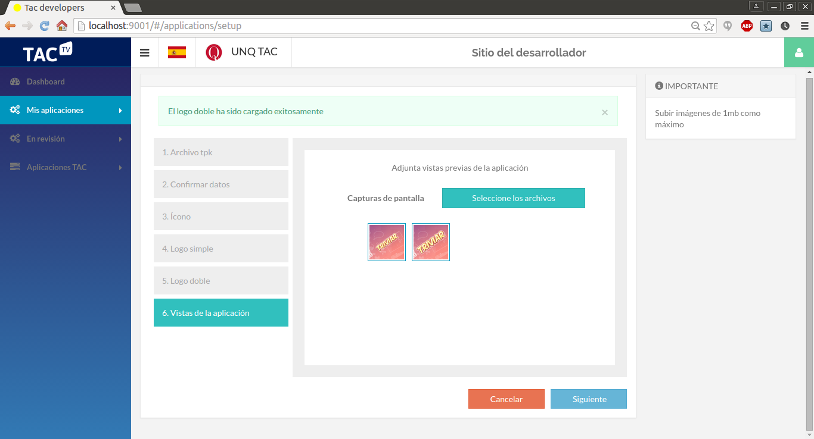
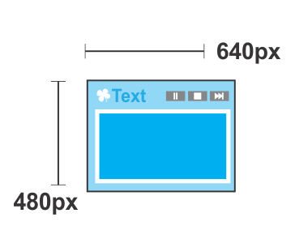

# Sitio del Desarrollador TAC-TV

El sitio de desarrollador es una herramienta para el desarrollador de aplicaciones TAC-TV que permite al mismo administrar en forma ágil sus aplicaciones y ser asistido en el proceso de publicación de aplicaciones.

El siguiente documento describe el sitio de desarrollador TAC. Nos mostrará los conceptos generales y en particular el proceso de publicación de aplicaciones TAC-TV.

## Ingreso a TAC-TV Desarrollador

### Ingreso

Si el desarrollador ya tiene una cuenta de desarrollo debe ingresar con su **usuario** y **clave** esto le permitirá acceder al panel de administración de sus aplicaciones.


### Registro

Si aún no es un usuario desarrolador registrado en la pantalla de _Ingreso_ debe seleccionar la opción **Registrate** abajo del ingreso de usuario y clave. El proceso de registro le pedirá unos datos necesarios para el registro entre ellos un email válido dónde recibirá un mail con un link y código de activación.


Si ya pose el código puede ingresar directamente el código para finalizar el proceso.


## Publicación de Aplicaciones

La publicación de aplicaciones, o nuevas versiones de las mismas, es un proceso paso a paso que asiste al desarrollador en dicha tarea. La tienda tiene distintos componentes que se muestran en base a la información ingresada en el proceso de publicación (screenshots, iconos, descripción, etc). Esta información es relevante para que el usuario TAC-TV encuentre atractiva la aplicación y entienda perfectamente su propósito.

A continuación se muestra los componentes principales de una aplicación en la _Tienda TAC-TV_.

Logos simple y dobles. El tamaño de los logos es arbitrario y seleccionado por la tienda al momento de ingresar.


Detalle de aplicación.


### Paso 1 - Subir el Paquete de Instalación TAC (TPK)

Un TPK es un paquete de instalación de la TAC. El primer paso de la publicación de una aplicación es subir el TPK de donde se obtienen ciertos datos de la aplicación.


### Paso 2 - Confirmar Datos

El paso 2 permite verificar que los valores del TPK son correctos. En caso afirmativo el desarrollador continuará con la publicación. En caso contrario deberá generar un nuevo TPK y volver a comenzar el proceso.


Una vez confirmado el TPK se procede a la carga de la información multimedia que se mostrará en la tienda.

### Paso 3 - Icono 

El ícono se mostrará en la tienda de aplicaciones cuando se ingrese al detalle de la aplicación.


Medidas sugeridas del ícono:


### Paso 4 - Logo Simple

En este paso se sube el logo simple que se mostrará en la tienda en las distintas categorías. Los logo son fundamentalmente importante, así como el nombre de la aplicación, para atraer al usuario TAC-TV.


Medidas sugeridas del logo simple:


### Paso 5 - Logo Doble

En este paso se pide subir el logo doble que se mostrará en la tienda en las distintas categorías.


Medidas sugeridas del logo doble:


### Paso 6 - Capturas de Pantalla

En este paso se suben las capturas de pantalla relevantes de la aplicación. Es importante una buena selección imágenes que sea representativo de la aplicación.



Medidas sugeridas de las capturas de pantalla:



Una vez ingresada toda la información la aplicación queda **pendiente de aprobación**. Es importante entender que las aplicaciones una vez publicadas por el desarrollador pasan por un proceso de aprobación que puede implicar la corrección de ciertos aspectos de la aplicación.

## Desarrollo de Aplicaciones

Las aplicaciones de la TAC-TV son aplicaciones HTML5 estándar, esto es, no pueden utilizar _Flash_, _Silverlight_ u otros plugins. El desarrollo se realiza sobre **Chromium 41** o superior y se debe contemplar que la aplicación debe estar diseñada para una resolución de **720p** y para interacción con un control remoto.

El mapeo de las teclas sigue el estándar W3C https://lists.w3.org/Archives/Public/public-web-and-tv/2011May/att-0039/vk-for-tv.html.


El siguiente es el mapeo de teclas del control en _coffeescript_:

```coffee
keycodes = [
        key: 'left'
        code: 37
      ,
        key: 'up'
        code: 38
      ,
        key: 'right'
        code: 39
      ,
        key: 'down'
        code: 40
      ,
        key: 'enter'
        code: 13
      ,
        key: 'info'
        code: 457
      ,
        key: 'info'
        code: 73 # keyboard I
      ,
        key: 'red'
        code: 403
      ,
        key: 'red'
        code: 82 # keyboard R
      ,
        key: 'green'
        code: 404
      ,
        key: 'green'
        code: 71 # keyboard G
      ,
        key: 'yellow'
        code: 405
      ,
        key: 'yellow'
        code: 89 # keyboard Y
      ,
        key: 'blue'
        code: 406
      ,
        key: 'blue'
        code: 66 # keyboard B
      ,
        key: 'play'
        code: 415
      ,
        key: 'play'
        code: 32 # keyboard space
      ,
        key: 'pause'
        code: 19
      ,
        key: 'pause'
        code: 80 # keyboard P
      ,
        key: 'rewind'
        code: 412
      ,
        key: 'rewind'
        code: 74 # keyboard j
      ,
        key: 'fast_fwd'
        code: 417
      ,
        key: 'fast_fwd'
        code: 75 # keyboard k
      ,
        key: 'page_up'
        code: 33
      ,
        key: 'page_down'
        code: 34 # keyboard k
      ,
        key: 'previous'
        code: 422
      ,
        key: 'next'
        code: 423 
      ,
        key: 'go_back'
        code: 166
      ,
        key: 'go_back'
        code: 86 # keyboard V
      ,
        key: 'subtitle'
        code: 460
      ,
        key: 'audio'
        code: 176
      ,
        key: 'favorites'
        code: 372
      ,
        key: 'help'
        code: 47
      ,
        key: 'menu'
        code: 18
      ,
        key: 'anterior'
        code: 413
        
      ,{key: 'number_0',code: 48}
      ,{key: 'number_1',code: 49}
      ,{key: 'number_2',code: 50}
      ,{key: 'number_3',code: 51}
      ,{key: 'number_4',code: 52}
      ,{key: 'number_5',code: 53}
      ,{key: 'number_6',code: 54}
      ,{key: 'number_7',code: 55}
      ,{key: 'number_8',code: 56}
      ,{key: 'number_9',code: 57}     
    ]
```

Actualmente las herramientas utilizadas por nuestro equipo de desarrollo incluyen el uso de:

- [Grunt](http://gruntjs.com)
- [Bower](http://bower.io)
- [AngularJs](https://angularjs.org)

Pero cualquiero otro framework como [jQuery](https://jquery.com), [Backbone.js](http://backbonejs.org), [Polymer](https://www.polymer-project.org), [Enyo](http://enyojs.com), etc. La selección  dependerá de la experiencia previa del equipo de desarrollo y gusto personal.

## Creación de un TPK

La estructura de un paquete de instalación TAC (TPK) es simple. La misma está compuesta de un archivo `manifest.json` que contiene la información referida a la aplicación.

El TPK es en última instancia un archivo `tar.gz` con la siguiente estructura básica para el caso de aplicaciones web tradicionales:

    +
    |_ manifest.json
    |_ icon.png


En el caso que la aplicación este autocontenida tendrá las carpetas y contenido correspondientes.

### Estructura del manifest.json

La estructura básica del json del manifest se muestra en el siguiente ejemplo de una aplicación de Trivia. en [`schemamanifest.json`](resources/schemamanifest.json) se encuentra la especificación completa.

```json
{
    "vendor": "UNQ",
    "id": "ar.edu.unq.utics.tac.triviar",
    "components": [
        {
            "type": "app",
            "id": "ar.edu.unq.utics.tac.triviar",
            "name": "Triviar",
            "description": "Triviar es un juego educativo didáctico de preguntas y respuestas. Triviar te permite jugar con tus amigos en la misma TAC o en línea con otros jugadores. Empezá a jugar y demostrá todo lo que sabes!",
            "version": "0.0.1",
            "main": "http://tiendatac.minplan.gob.ar/triviar",
            "icon": "icon.png",
            "categories": ["Tiempo Libre", "Juegos"],
            "dependencies": [
                "ar.edu.unlp.info.lifia.tvd.system"
            ]
        }
    ],
    "vendor-url": "http://www.unq.edu.ar/",
    "version": "0.0.1",
    "platform": "all",
    "api-level": "1.0"
}

```

### Herramienta de Empaquetamiento

Se provee la siguiente utilidad para la generación de paquetes para la TAC (TPK) y la metadata para las aplicaciones desarrolladas por la UNQ.

Para la validación del `manifest.json` se requiere primero la instalación de las siguientes herramientas:

    $ gem install json_schema
    
**Linux**

    $ sudo apt-get install jshon

**OSX**

    $ brew install jshon


En caso de no encontrarse el script procederá sin la validación correspondiente.

#### Uso

    $ ./packager.sh carpeta nombre

El script se obtiene de [`packager.sh`](resources/packager.sh)

Donde, `carpeta` es la carpeta raíz donde reside la metadata del paquete (manifest.json) y `nombre`el nombre del TPK a generar.
